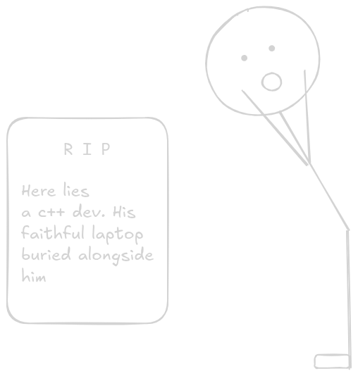
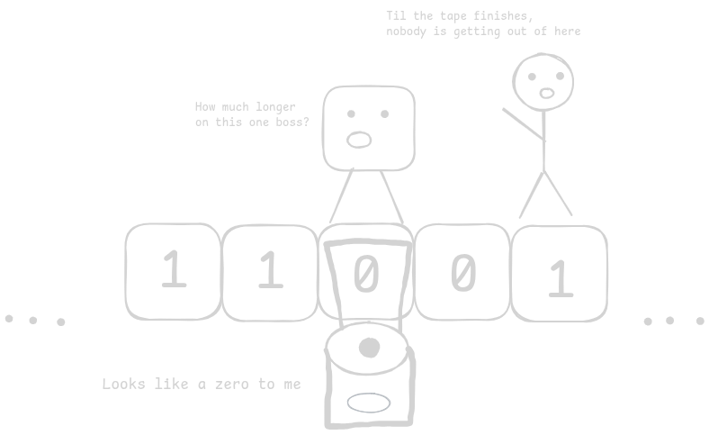
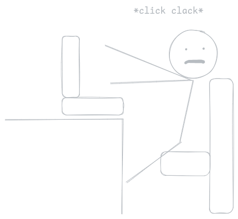
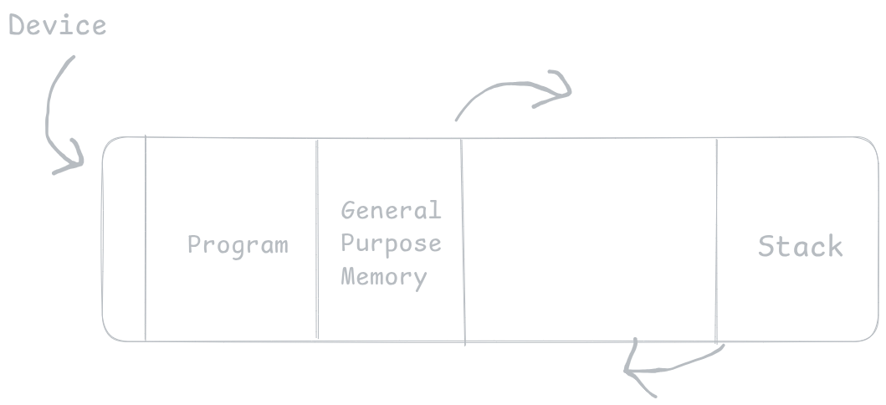

Project Link: [github.com/errorcodezero/turbine](https://github.com/errorcodezero/turbine)

*Please star my project. I'm trying to qualify for [shipwrecked](https://shipwrecked.hackclub.com) and I need a certain amount of github stars to qualify*

To start this off, I want to say that it's been a while since I've created a new post. I quite frankly had been quite occupied with other activities and didn't give writing anything the time it needed. However, in those months of absence, I went down all sorts of paths in my programming journey that I never would have believed that I would go down. I want to give a brief story of how it all began.

## Story Time

It all started off with [Advent of Code](https://adventofcode.com). More specifically, [day 7 for 2015](https://adventofcode.com/2015/day/7). This advent of code actually stumped me for a bit since I had no idea how I was to approach this problem. Little did I know, this problem single-handedly would get me into langdev and learning more about systems programming. Before this, I really had no purpose in learning languages like C, Rust, C++, etc since I didn't feel they fit into the kinds of projects which I was making. Sure, I did make some [mastodon bot using Rust](/blog/building-snake-for-mastodon/) but, a systems language truly didn't provide me many benefits over any other language I could have used.

Langdev flipped my entire perception. All of a sudden, being able to play around with memory on your own without a garbage collector became a blessing. I actually started making my own programming language called [mango](https://github.com/errorcodezero/mango) around this time following the guide from [Crafting Interpreters](https://craftinginterpreters.com/). I genuinely think that without this amazing book, I would be nowhere right now.

While I was building my language, I was also learning about different conceptual things about computers. But one of them particularly caught my eye. **Bytecode Virtual Machine**. The idea of a bytecode vm is that it's structured a lot like an actual computer and code is compiled to run for that imaginary target. The bytecode vm itself is then the only thing that needs to be ported over to new platforms as through that, all the programs that are written in the language that utilize it come on over as well. The idea of building my own virtual machine was very intriguing. I decided to put mango on pause for a bit while I worked on building up this new and interesting idea.

Simultaneously, I also found myself somewhat fascinated with emulation and old computers. I enjoyed the simplicity that they had to work with having limited memory. I wanted to try to work with the same constraints that they worked with.

Through all of these different factors, I finally decided, let's build a virtual machine for my own custom CPU architecture. As any programmer knows however, the only way for a project to be guaranteed success is to have a good name. The project is doomed to fail otherwise.

> "*turbine*, that sounds pretty cool to me" - me

When you think of a turbine, you think of something fast and airy. I figured that'll suffice.

## To Kill a Programmer by Bjarne Stroustrup


*bit of an artist here if you couldn't already tell*

I decided to write my bytecode vm in C. While I've had used C before, I didn't have any big projects with it. My usage of it went as far as just poking around with it and shoving hello world programs into gcc. I did however have decent experience with C++ which coming out of developing mango I had began to get somewhat sick of. It was great for what it was but I got tired of all the complexities it brought with it. The last thing I wanted to even think about was move semantics and rules of 3/5/7(is it 9 now?).

C felt like a breath of fresh air to me. I liked it for the same reason that I enjoyed emulation and old computers: *the simplicity*.

> what about rust? or zig? - you

I'm not sure on the rust end. I don't know zig. Anyways, I quickly started up a new git repo and set up my build system. After I finished the new project rigmarole, I paused. I realized I have no clue how to start. I needed to create a structure for the virtual machine. But how does a virtual machine even work? How does an actual computer even work? I thought it was just magic turning rocks into thinking machines.

## Crash Course in Computer Science History


*turing machine*

Ok let's strip away everything unique and fancy from a computer and let's take it to the bare minimum. No fancy 5090 TI, no retina display, no true type fonts, no nothing. In fact it's barely digital. It's just a fancy pencil(and eraser!) combined with a sensor.

There's also an infinite roll of tape and the machine can roll the tape to the left, or to the right and make changes to the tape. There's also a set of instructions that control what actually happens to the tape.

Despite it's admittedly underwhelming specs, theoretically, this machine could solve any [computable](https://en.wikipedia.org/wiki/Computability) problem! You might even be able to do something useful if you abuse it enough.

Why does this ancient specimen of a computer matter? What is this dinosaur-age relic? It's called the turing machine and it's an idea thought of by English mathematician Alan Turing. We need to understand what it is to see if our processor will actually be usable. The turing machine can theoretically solve any computable problem, making something that is turing-complete(able to do the same things as the turing machine) also be able to solve those problems.

In order for it to be turing complete, it needs to be able to be able to:

- read and store data with theoretically unlimited memory
- capability for conditional branching(if statements
or at a lower level comparisons and jumps)
- iteration(looping or again comparisons and jumps)

Turing-completeness sounds like a high and mighty standard to try to keep up to; really it's the bare minimum. Almost every computer you can find around you is probably turing complete. Your pc, your smart watch, your phone, etc. Even old consoles like the NES were turing complete as well. So it can't be that hard.

## Working and learning about CPUs



First, a brief overview of the different parts of a cpu. At its core, a CPU contains registers. Contrary to what you might think, a CPU doesn't work directly off memory addresses. It copies things from memory into registers to use and modify them. Modern CPUs have like nearly 100 registers. I have 9...

Let's talk about each of the registers. Register A, B, C, D, and E are general purpose. They can be used for pretty much anything. They're 2 bytes in size. The other registers are a bit more specialized:

- Instruction Pointer - Most important register since it points to the instruction the CPU should execute.
- Stack Pointer - Points to the top of the stack(I'll explain this)
- Base Pointer - Points to the base of the stack(again, I'll explain)
- Status Register - Status flags(I'll explain this too)
- Accumulator - After an arithmetic or bitwise operation, the result gets stored here.

### quick: what's a stack?


*recognize this? it's a stack overflowing*

It's a data structure like a stack of pancakes. Stuff goes into the top and when you remove stuff off the top. Surprisingly, this simple data structure is really important for CPUs, langdev, and a lot of different areas in computer science.

It's so important, that many CPUs have dedicated instructions for manipulating the stack, typically variants of `PUSH` and `POP` to add and remove from the stack respectively. Something strange to understand is that the stack typically operates backwards(starts at higher memory addresses and works its way down). This means that the top of the stack is at the lowest memory address of the stack.

This reverse order makes sense when you think of the memory growing towards each other.


*Notice how as stack and general purpose memory both grow, they go towards each other. This makes a lot more sense than the stack starting from the middle and the general purpose memory colliding with it early on. Now, the split for the stack and the general purpose memory can be however the programmer wishes*

### back to the programming

Before I got into the code, I wanted to start by building an instruction set. Throughout the entire dev process, the instruction set went through so many different changes and iterations until I finally got it to my liking. Here are the instructions:

- `0x0` -> `LOAD [reg flag] [mem addr]`    -> Load data into register from memory address
- `0x1` -> `DUMP [reg flag] [mem addr]`    -> Dump data from register into memory address
- `0x2` -> `MOVE [reg flag] [reg flag]`    -> Move data from first register into second
- `0x3` -> `LDD [reg flag] [data]`         -> Load data specified in argument into register
- `0x4` -> `PUSH [reg flag]`               -> Push data from register into stack
- `0x5` -> `POP [reg flag]`                -> Pop data off the stack and into the register
- `0x6` -> `ADD [reg flag] [reg flag]`     -> Add both registers together
- `0x7` -> `ADC [reg flag] [reg flag]`     -> [Add with carry](https://retrocomputing.stackexchange.com/questions/29805/what-does-an-adc-add-with-carry-instruction-following-add-do) both registers together
- `0x8` -> `SUB [reg flag] [reg flag]`     -> Subtract both registers
- `0x9` -> `SBB [reg flag] [reg flag]`     -> [Subtract with borrow](https://stackoverflow.com/questions/21863607/what-is-a-borrow-in-hexadecimal-subtraction-assembly) both registers
- `0xA` -> `NOT [reg flag]`                -> Bitwise NOT on a given register
- `0xB` -> `OR [reg flag] [reg flag]`      -> Bitwise OR on a given register
- `0xC` -> `AND [reg flag] [reg flag]`     -> Bitwise AND on a given register
- `0xD` -> `CMP [reg flag] [reg flag]`     -> Compare two registers
- `0xE` -> `JUMP [status flag] [mem addr]` -> Move instruction pointer to given memory address if given status flag is set
- `0xF` -> `HLT`                           -> Stop the program execution

It's a very simple instruction set by design. I wanted all the instructions to fit within a single hexadecimal digit.

Some more details about the processor are that it has a 16-bit data bus. This means that the memory addresses themselves are 2 bytes. The word size(how much can be stored at a given memory address) is 8-bit since that's typically the norm with computers. However, this discrepancy in the word size and the data bus size means that in order for registers like the stack pointer to store a memory address, they need to be 2 bytes wide. That's why nearly all the registers are 2 bytes(except the status register). For the instructions to specify a register in their arguments, a set of register flags need to be created as well:

- `0x0` -> `RA_BYTE`               -> 1 byte to register A
- `0x1` -> `RA_TWO_BYTES`          -> 2 bytes to register A
- `0x2` -> `RB_BYTE`               -> 1 byte to register B
- `0x3` -> `RB_TWO_BYTES`          -> 2 bytes to register B
- `0x4` -> `RC_BYTE`               -> 1 byte to register C
- `0x5` -> `RC_TWO_BYTES`          -> 2 bytes to register C
- `0x6` -> `RD_BYTE`               -> 1 byte to register D
- `0x7` -> `RD_TWO_BYTES`          -> 2 bytes to register D
- `0x8` -> `RE_BYTE`               -> 1 byte to register E
- `0x9` -> `RE_TWO_BYTES`          -> 2 bytes to register E
- `0xa` -> `STACK_PTR`             -> 2 bytes to stack pointer
- `0xb` -> `BASE_PTR`              -> 2 bytes to base pointer
- `0xc` -> `ACCUMULATOR_BYTE`      -> 1 byte to accumulator
- `0xd` -> `ACCUMULATOR_TWO_BYTE`  -> 2 byte to accumulator
- `0xe` -> `STATUS`                -> Status flag(1 byte) to status register

You may notice have most of the registers have a one and two byte variant for their flags. This is because there are many cases in which I only want to use one byte of data. For example, if I want to dump the contents of register A that contains an ascii character to memory address 0x0 in order to try to print it to the console, I don't want to dump two bytes and overflow into memory address 0x1.

This isn't the case for the stack and base pointer since they are as they say: a pointer. They always need to deal with data of two bytes since they deal with memory addresses which means there's no use to adding one and two byte variants of their register flags. They always work with two bytes.

You may be wondering what the status register is for. That contains the status after various operations. For example, using the `CMP` instruction, if I compared two registers, the result of the comparison would be put into the status register. The `JUMP` instruction reads the status register and checks it with the status flag passed in as an argument. If the argument matches with the flag in the register, then it jumps to the given memory address. Here are the various status flags:

- `0x0` -> `CMP_EQUAL_TO`     -> When `CMP` finds both registers equal to each other
- `0x1` -> `CMP_GREATER_THAN` -> When `CMP` finds register a greater than b
- `0x2` -> `CMP_LESS_THAN`    -> When `CMP` finds register a less than b
- `0x3` -> `ADD_CARRY`        -> When `ADC` or `ADD` set a carry flag
- `0x4` -> `ADD_NO_CARRY`     -> When `ADC` or `ADD` don't set a carry flag
- `0x5` -> `SUB_BORROW`       -> When `SBB` or `SUB` set a carry flag
- `0x6` -> `SUB_NO_BORROW`    -> When `SBB` or `SUB` don't set a carry flag

### actually programming(finally)

First, I created a struct for a VirtualMachine.

```c
typedef struct VirtualMachine {
  uint16_t register_a;
  uint16_t register_b;
  uint16_t register_c;
  uint16_t register_d;
  uint16_t register_e;
  uint16_t stack_pointer;
  uint16_t base_pointer;
  uint16_t accumulator;
  uint16_t instruction_pointer;
  StatusFlag status_register;
  uint8_t *memory;
  Device **devices;
  bool halted;
} VirtualMachine;
```

Essentially there's a field for each register and a byte array for the memory of the system. There's also an array of devices in which the different devices that tie into each CPU cycle are added. 

Moving on, there's also the halted field which is set to true when the CPU encounters an `HLT` instruction. Execution gets halted when the flag is set.

I went on to create some basic functions to initialize and destroy the vm.

```c
VirtualMachine init_vm() {
  uint8_t *memory = malloc(sizeof(uint8_t) * MEMORY_SIZE);

  VirtualMachine vm;
  memset(&vm, 0, sizeof(vm));
  vm.base_pointer = RAM_END;
  vm.stack_pointer = RAM_END;
  vm.instruction_pointer = RAM_START;
  vm.halted = false;
  vm.memory = memory;
  vm.devices = devices;

  return vm;
}

void delete_vm(VirtualMachine *vm) {
  free(vm->memory);
  vm->memory = NULL;
}
```

Most of the fields of the struct can just be zeroed out when they're being created. The only ones I have to actually set manually are the stack related registers(stack and base pointer start from the highest memory addresses, remember?) as well as the halted flag. Not to mention having to allocate memory for well, the vm's memory.

Now finally onto the exciting part, making the VM actually run. I created a step function which will step the vm through an instruction.

```c
void step_vm(VirtualMachine *vm);
```

At this step, I could have gone with many different things for actually stepping the vm through. Something interesting that caught my attention was the idea of computed gotos via gcc extensions. Gcc has a lot of interesting extensions but computed gotos are what I found very interesting. It allows you to get the address of a label and store that within an array. The idea with this is that since each instruction has a unique bytecode, it indexes into the array with that unique bytecode and grabs the label at that given point to jump to using a goto statement. This allows for some incredibly fast conditional logic.

I decided against computed gotos since I felt that would harm the portability of the program and I figured that the compiler could probably optimize the switch statement into something roughly equivalent to what the computed goto could provide me anyways. I just thought it was an interesting idea though and something similar might be able to be accomplished with function pointers.

Anyways, I decided to go with a switch statement. Since nearly every instruction uses register flags, I created a quick function to make the process of parsing the register flag a lot easier. I just pass in a pointer to a pointer to a uint16_t and modify the second pointer to point to the correct register.

```c
void reg_flag_parser(VirtualMachine *vm, uint16_t **ptr) {
  switch (vm->memory[vm->instruction_pointer++]) {
    // ...
  }
}
```
*switch statement again*

This function wouldn't tell me if I'm using the one or two byte version of the register though. It would only give a pointer to the register. Because of this, each case in the other switch statement would check if it's the one or two byte register flag.

```c
case POP: {
  uint16_t *reg = NULL;
  reg_flag_parser(vm, &reg);
  switch (vm->memory[vm->instruction_pointer - 1]) {
  case RA_BYTE:
  case RB_BYTE:
  case RC_BYTE:
  case RD_BYTE:
  case RE_BYTE:
  case ACCUMULATOR_BYTE:
  case STATUS: {
    *reg = vm->memory[++vm->stack_pointer];
    break;
  }
  case RA_TWO_BYTES:
  case RB_TWO_BYTES:
  case RC_TWO_BYTES:
  case RD_TWO_BYTES:
  case RE_TWO_BYTES:
  case STACK_PTR:
  case BASE_PTR:
  case ACCUMULATOR_TWO_BYTES: {
    uint8_t right = vm->memory[++vm->stack_pointer];
    uint8_t left = vm->memory[++vm->stack_pointer];
    *reg = u16_combine(left, right);
  }
  }
  break;
}
```

*Notice how I went back in order to check the register again. A good optimization at this point would have been to maybe take in two pointers in the reg_flag_parser function where one is of type uint8_t\*\* and the other is of type uint16_t\*\**

The functionality itself was pretty simple. The instructions aren't anything that complicated so I didn't struggle very much. A few other notable things are that I created a small debug print utility which would help with printing out memory addresses and register contents.

```c
void debug_print_vm(VirtualMachine *vm) {
  printf("\nRegister A: 0x%x\n", vm->register_a);
  printf("Register B: 0x%x\n", vm->register_b);
  printf("Register C: 0x%x\n", vm->register_c);
  printf("Register D: 0x%x\n", vm->register_d);
  printf("Register E: 0x%x\n", vm->register_e);
  printf("Accumulator: 0x%x\n", vm->accumulator);
  printf("Instruction Pointer: 0x%x\n", vm->instruction_pointer);
  printf("Stack Pointer: 0x%x\n", vm->stack_pointer);
  printf("Base Pointer: 0x%x\n", vm->base_pointer);
  printf("Status Register: 0x%x\n", vm->status_register);
  printf("Memory: \n");
  for (uint16_t i = 0; i < MEMORY_SIZE; i++) {
    if (vm->memory[i] != 0) {
      printf("0x%x -> 0x%x\n", i, vm->memory[i]);
    }
  }
  printf("\n");
}
```

Debug prints look something like this:

```
Register A: 0x21
Register B: 0x0
Register C: 0x0
Register D: 0x0
Register E: 0x0
Accumulator: 0x0
Instruction Pointer: 0x56
Stack Pointer: 0xffff
Base Pointer: 0xffff
Status Register: 0x0
Memory:
0x1 -> 0x3
0x3 -> 0x48
0x4 -> 0x1
0x8 -> 0x3
0xa -> 0x65
0xb -> 0x1
0xf -> 0x3
0x11 -> 0x6c
0x12 -> 0x1
0x16 -> 0x3
```

I also wanted to add a system for devices. For devices, I created a system with arrays and function pointers. Each device would be in its own struct that contains a function pointer and on every cpu cycle(every step in this case basically), it would run each device's on cycle function. It looked something like this:

```c
// device.h
typedef struct Device {
  // for memory mapping purposes
  uint16_t start;
  uint16_t end;
  uint8_t prev_change_indic;
  // on each cpu cycle, this function gets ran
  void (*on_cycle)(VirtualMachine *vm);
} Device;

// device.c
void console_on_cycle(VirtualMachine *vm) {
  uint8_t *data = &vm->memory[console.start];
  if (*data != 0) {
    printf("%c", *data);
    *data = 0;
  }
}

Device console = {.start = 0x0, .end = 0x0, .on_cycle = console_on_cycle};
Device *devices[] = {&console};
```

On each step, it would loop over the device array and run each setup function:

```c
void step_vm(VirtualMachine *vm) {
  // ...
  for (uint8_t i = 0; i < DEVICES_LENGTH; i++) {
    devices[i]->on_cycle(vm);
  }
  // ...
}
```

I only have one device added to the system currently but I think that I might give a virtual screen a try. Anyways, with this one device, all it does is monitor the memory address 0x0 for any changes and then on change will print it out to the console before zeroing it out.

After messing around with the vm until I was sure it finally worked, I figured I would need an assembler. It's a huge pain to be writing bytes by hand. I whipped up a quick lua script that would split my program by spaces and parse each instruction. Using a lookup table, it would either replace an instruction/flag/whatever else with a value or it would try to parse it as a number.

Finally, I could write simple programs like this:

```
LDD RA_BYTE 0x48
DUMP RA_BYTE 0x0 0x0
LDD RA_BYTE 0x65
DUMP RA_BYTE 0x0 0x0
LDD RA_BYTE 0x6C
DUMP RA_BYTE 0x0 0x0
LDD RA_BYTE 0x6C
DUMP RA_BYTE 0x0 0x0
LDD RA_BYTE 0x6F
DUMP RA_BYTE 0x0 0x0
LDD RA_BYTE 0x20
DUMP RA_BYTE 0x0 0x0
LDD RA_BYTE 0x57
DUMP RA_BYTE 0x0 0x0
LDD RA_BYTE 0x6F
DUMP RA_BYTE 0x0 0x0
LDD RA_BYTE 0x72
DUMP RA_BYTE 0x0 0x0
LDD RA_BYTE 0x6C
DUMP RA_BYTE 0x0 0x0
LDD RA_BYTE 0x64
DUMP RA_BYTE 0x0 0x0
LDD RA_BYTE 0x21
DUMP RA_BYTE 0x0 0x0
HLT
```
*hello world program, if you couldn't tell*

It's pretty crude and sure is a far cry from actually good assembly parsers like nasm and others like it that allow you to make subroutines and whatnot.

I also needed to get C to graciously open a file which is surprisingly harder than it seems. C file apis are very imperative and honestly annoying to work with(maybe this is what I get for picking C).

```c
#include "vm.h"
#include <stdint.h>
#include <stdio.h>
#include <stdlib.h>

int main(int argc, char *argv[]) {
  if (argc != 2) {
    fprintf(stderr, "Usage: turbine [file]\n");
    return EXIT_FAILURE;
  }
  FILE *fp = fopen(argv[1], "r");

  if (fp == NULL) {
    fprintf(stderr, "Failed to open file %s\n", argv[1]);
    return EXIT_FAILURE;
  }

  fseek(fp, 0L, SEEK_END);
  size_t file_size = ftell(fp);
  rewind(fp);

  uint8_t *file = malloc(file_size * sizeof(uint8_t));
  fread(file, file_size, 1, fp);

  VirtualMachine vm = init_vm();

  init_program_vm(&vm, file, file_size);
  free(file);
  file = NULL;
  bool debug = getenv("DEBUG");

  if (debug) {
    debug_print_vm(&vm);
  }
  while (!vm.halted) {
    step_vm(&vm);
    if (debug) {
      debug_print_vm(&vm);
    }
  }

  delete_vm(&vm);
  fclose(fp);
  fp = NULL;
  return EXIT_SUCCESS;
}
```

*I can finally take a file as an input and use it with the vm*

After testing everything and ensuring it works, I finally could play around with my creation. A real assembly parser is definitely needed before anymore work is done with this since it is an actual pain to write assembly like this. 

## Conclusion

This was a really fun project to build. I really love working with systems languages and building programs like this. I've become really tired of doing webdev and really can't stand it anymore. Things like this are really fun.

If you found this blog post interesting, continue giving [my project a star](https://github.com/errorcodezero/turbine)! I'm trying to qualify for [shipwrecked](https://shipwrecked.hackclub.com) and stars on my project get me further to my goal.
