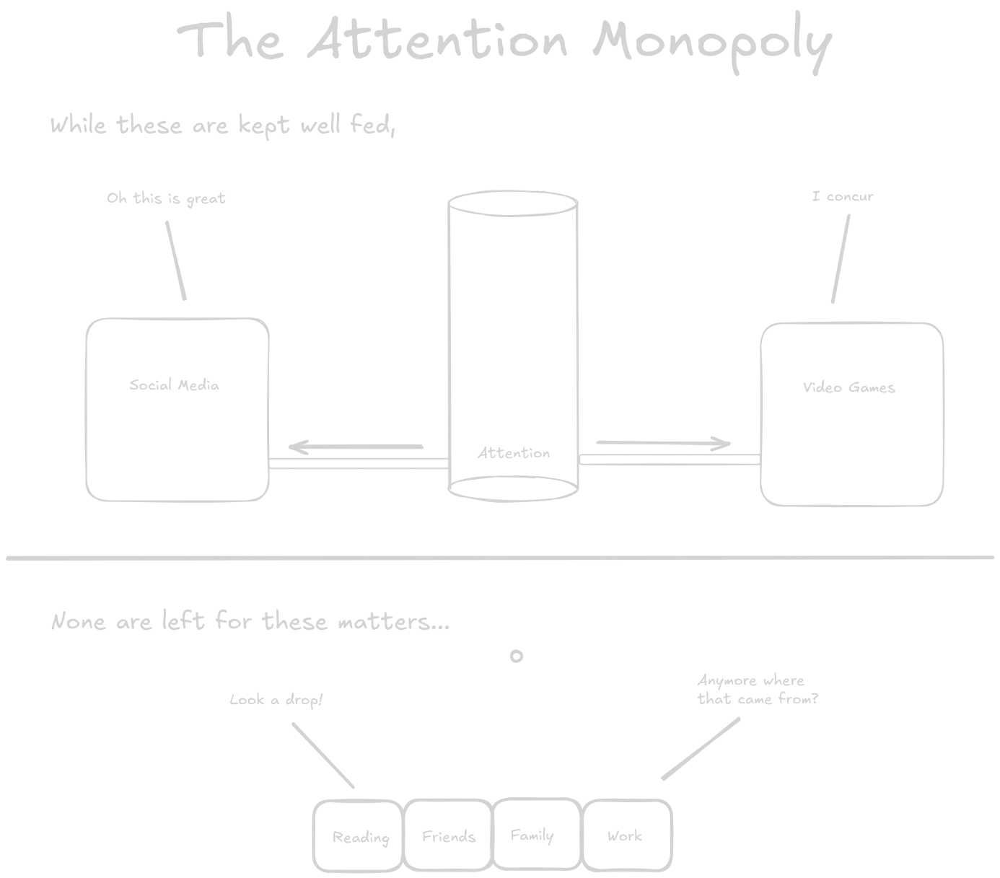

> If every minute you spent scrolling was instead spent by you reading or learning, how much smarter do you think you would be?

I thought of that question and it rocked me to my core for a bit. I definitely had a scrolling problem.
