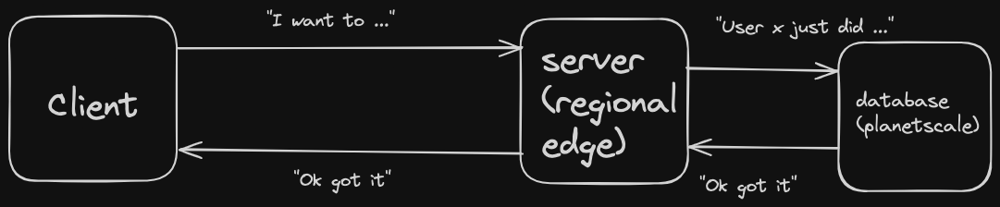

I had an interesting idea for a game. It would be a miniature society. In this society, there is competition for resources which are used to craft items. Items can be used to kill monsters. The goal is essentially to become the richest in the society and have the most power and influence. People also will try to get rare collectibles in game. It's similar to hypixel skyblock.

I wanted to give myself a challenge so I decided to make this game fully within the terminal. This way the system requirements are so low, even my computer will be able to run it. It's going to be a top down game. I also didn't feel like learning a new language so it's also going to be made in typescript. The advantages of building in typescript are that I will be able to use tools I am very familiar with to build a backend. I'm going to use the [t3](https://create.t3.gg) stack to build the backend. This will also let me have a web dashboard for leaderboards and maybe a public api that can be exposed later.

The game is essentially going to be fully text based and not really have any graphics. I think this is a good starting point and maybe I can begin to integrate graphics and "locations" in the game later. For example, there won't really be any movement(not yet at least) but there will be the ability to interact with the world via text.

## Only issue? I've never built a realtime multiplayer backend.

It is pretty simple what I planned for the model. Essentially I am going to just have a server using the edge runtime which takes in the user requests and just talks to the database. This should scale decently well. Not 100% sure how well this is going to work when I begin adding actual movement and lobbies into the game. This is my first time I am building anything that is this realtime and will have many streams of data coming in at once so I hope it goes well.

Note that regional edge means that the serverless functions spun up will always be near the database. Also note that we are using the [edge runtime](https://edge-runtime.vercel.app/) which isn't to be confused with the edge location.

## Name for this game?

I'm thinking...
